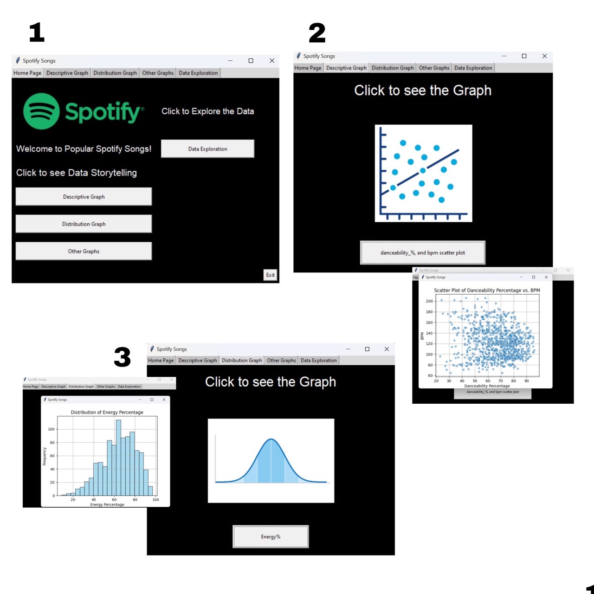
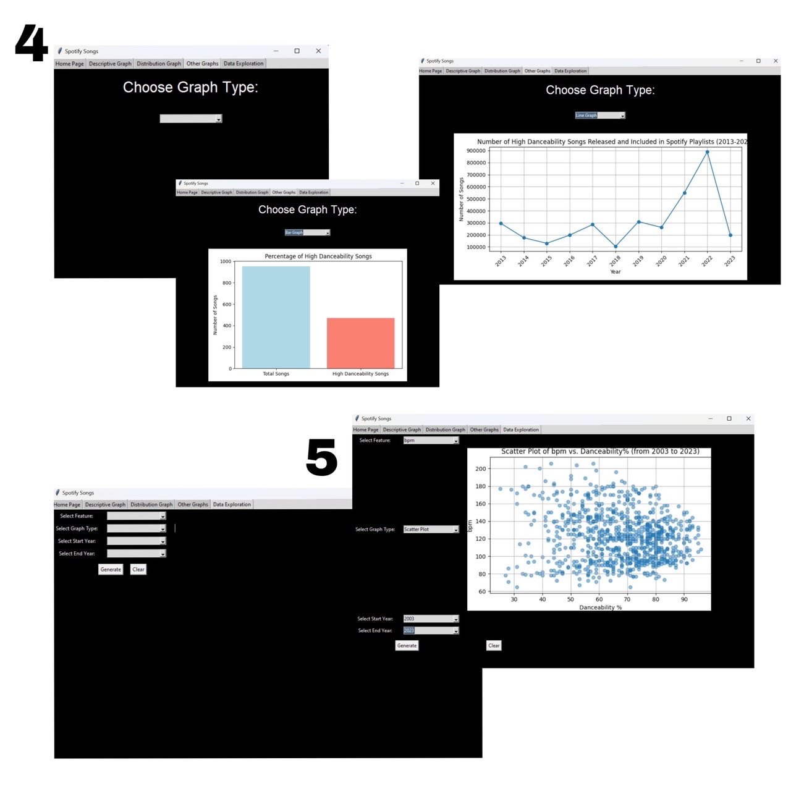
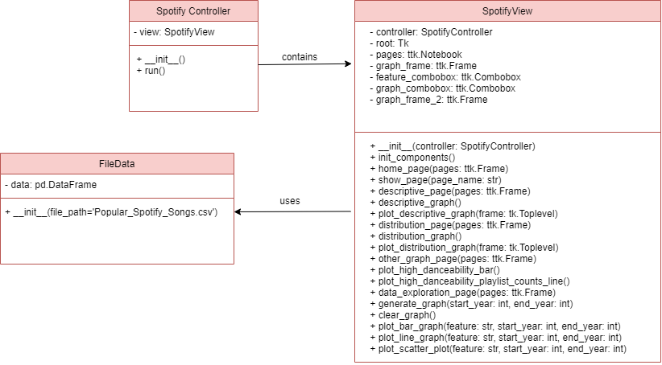

# Spotify Songs Visualization and Analysis

## Summary
This project aims to create a standalone GUI application using Python and Tkinter to visualize and analyze Popular Spotify Songs data. It provides descriptive statistics, correlations, and interactive visualizations to gain insights into music trends.

## Features
- Interactive GUI allowing users to explore Spotify song data.
- Visualization of distribution graphs, pie charts, and bar graphs for insights into song release years, danceability percentage, and other trends.
- Descriptive statistics and correlation analysis using scatter graphs for features such as danceability percentage and BPM (beats per minute), providing insights into the rhythm and tempo of songs.

## Screenshots

* 1.Home Page
* 2.Descriptive Graph Page
* 3.Distribution Graph Page



* 4.Other Graphs Page
* 5.Data Exploration Page

## UML CLASS DIAGRAM


## GitHub Repository
[Link to GitHub Repository](https://github.com/crparichaya/Popular-Spotify-Songs)

## Demonstration video
[Link to Demonstration video](https://youtu.be/XTmToobbfJI?si=XL4hMEi7nZtnB-pV)

## Wiki
[Link to Wiki](https://github.com/crparichaya/Popular-Spotify-Songs/wiki)

### Install and Run
To run this project locally, follow these steps:

1. **Clone the repository:**
   ```
   git clone https://github.com/crparichaya/Popular-Spotify-Songs.git your_directory_name
   ```

2. **Navigate to the project directory:**
   ```
   cd your_directory_name
   ```

3. **Create a virtual environment:**
   ```
   python -m venv env
   ```

4. **Activate the virtual environment:**
   ```
   # On MS Windows use .\env\Scripts\activate
   . env/bin/activate
   ```

5. **Install packages from requirements.txt:**
   ```
   pip install -r requirements.txt
   ```

6. **Run the main block:**
   ```
   python main.py
   ```


